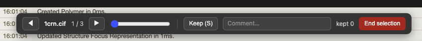

# FoldSift

**A lightweight protein structure viewer and curation tool for VS Code.**

FoldSift lets protein designers preview molecular structures inline, cycle through
a folder full of candidate designs, and triage the keepers into a CSV — without
ever leaving the editor. Rendering is powered by [Mol\*](https://molstar.org/), the
same engine behind the RCSB PDB, so you get full representations, selections,
measurements, and screenshot/camera controls for free.

> 💡 Structure files still open as **plain text by default**, so you can read the
> raw coordinates whenever you want. The 3D viewer is one right-click away.




## Features

- **3D structure viewer** — the full Mol\* viewport embedded in a VS Code tab.
- **Folder cycling** — step through every structure in a folder with the ◀ ▶
  buttons, a slider, or the **←/→** arrow keys. Files load lazily, so a folder with
  hundreds of designs stays light on memory.
- **Curation to CSV** — mark the structures you want to keep and export them, with
  per-structure metadata and free-text comments, to a timestamped CSV.
- **Wide format support** — works with the formats below straight from raw text.
- **Reads as text too** — view the underlying coordinates anytime; the 3D editor is
  opt-in, not forced.

## Supported formats

| Extension(s) | Format |
| --- | --- |
| `.pdb`, `.ent` | PDB |
| `.pdbqt` | AutoDock PDBQT |
| `.cif`, `.mmcif` | mmCIF |
| `.gro` | GROMACS |
| `.mol2` | Tripos MOL2 |
| `.sdf`, `.sd` | SDF |
| `.mol` | MDL MOL |
| `.xyz` | XYZ |
| `.bcif` | BinaryCIF |

Any of the above may also be gzip-compressed (e.g. `model.pdb.gz`, `1abc.bcif.gz`) —
FoldSift decompresses them transparently.

## Usage

### View a single structure

Right-click a structure file in the Explorer → **FoldSift: View Structure**.
(Or use **Reopen Editor With… → FoldSift Structure Viewer** from an open file.)

### Cycle through a folder

Right-click a folder — or multi-select several files — → **FoldSift: View Folder**.
Use ◀ ▶, the slider, or the **←/→** arrow keys to move between structures.

### Curate a set of structures

Right-click a folder → **FoldSift: Curate Structures**, then:

1. Click **Start selection** — this creates `foldsift_selections_<timestamp>.csv`
   in the folder.
2. While cycling, click **Keep** (or press **S**) to mark the current structure;
   click/press again to unmark.
3. Optionally type a note in the **Comment** box — it's saved per structure and
   written next to it in the CSV.
4. Click **End selection** to finish and open the CSV.

The CSV is rewritten atomically on every change, so unmarking a structure cleanly
removes its row and comment edits land immediately.

### CSV columns

| Column | Description |
| --- | --- |
| `index` | 1-based position in the cycled set |
| `filename` | File name |
| `full_path` | Absolute path on disk |
| `format` | Parsed format (`pdb`, `mmcif`, …) |
| `num_chains` | Chain count |
| `num_residues` | Residue count |
| `num_atoms` | Atom count |
| `seq_length` | Sequence length |
| `sequence` | One-letter sequence, chains joined by `/` |
| `comment` | Your free-text note for this structure |
| `selected_at` | ISO-8601 timestamp when kept |

Sequence and counts are extracted for PDB-family and mmCIF inputs; coordinate-only
formats (e.g. `.xyz`, `.gro`, `.mol2`) render in the viewer but leave those columns
blank.

## Settings

| Setting | Default | Description |
| --- | --- | --- |
| `foldsift.recursiveFolderScan` | `false` | Include structures in subfolders when scanning a folder. |
| `foldsift.backgroundColor` | `#1e1e1e` | Viewport background color (hex). |
| `foldsift.keepHotkey` | `s` | Single key used to toggle **Keep** during curation. |

## Keyboard shortcuts

| Key | Action |
| --- | --- |
| `←` / `→` | Previous / next structure |
| `S` | Toggle **Keep** on the current structure (during curation) |

The Keep key defaults to `S` and can be changed via `foldsift.keepHotkey`.
Shortcuts are ignored while the Comment box is focused, so you can type freely.

## Requirements

- VS Code `1.85.0` or newer.

## Known limitations

- Sequence/counts come from atom records; non-standard residues map to `X` and
  nucleotides to lowercase.
- Mol\* runs without web workers in the webview — fine for typical designs, slower
  on very large assemblies.
- Binary formats (`.bcif`) render in the viewer but don't get sequence/count
  extraction in the curation CSV (those columns are left blank).
- Not yet supported: multi-model/trajectory animation, saving Mol\* sessions, and
  appending across separate curation sessions.

## Development

```bash
npm install
npm run compile      # builds dist/extension.js + dist/webview.js
# then press F5 in VS Code to launch the Extension Development Host
```

- `npm run watch` — rebuild on change
- `npm run typecheck` — `tsc --noEmit`
- `npm test` — decode tests (gzip/BinaryCIF round-trip + Mol\* parse)

## Credits

Developed by **Kody Klupt**.

3D rendering by [Mol\*](https://molstar.org/) (Sehnal et al.). FoldSift bundles
Mol\* and provides the VS Code integration and curation workflow.

## License

Released under the [MIT License](LICENSE) © 2026 Kody Klupt.
